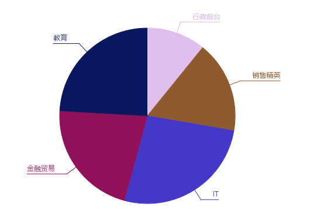

# drawpie
You can draw a pie depend on your data.

## 效果


## 使用
+ 引入drowPie.js文件
+ 初始化一个饼图，`new Pie()`,参数为对象
+ 对象必须包含属性
  container: 饼图绘制的区域。
  data: 数据，一个数组，每一项是一个对象，对象里包含数据描述和数量。
  textProp: 数据描述对应的属性。
  dataProp: 数量对应的属性。
+ 对象可选属性
  r: 饼图的半径。
  lineOffset: 引线超出饼图的长度，默认为20。
  textOffsetX: 说明文字水平方向偏移量，默认为20。
  textOffsetY: 说明文字垂直方向偏移量，默认为5.
```js
//example
var dataArr = [
    {"job": "行政前台", "salary": 4500},
    {"job": "销售精英", "salary": 7000},
    {"job": "IT", "salary": 11000},
    {"job": "金融贸易", "salary": 9000},
    {"job": "教育", "salary": 10000}
];
var p = new Pie({
    container: div,
    data: dataArr,
    textProp: "job",
    dataProp: "salary"
});
p.draw();
```

